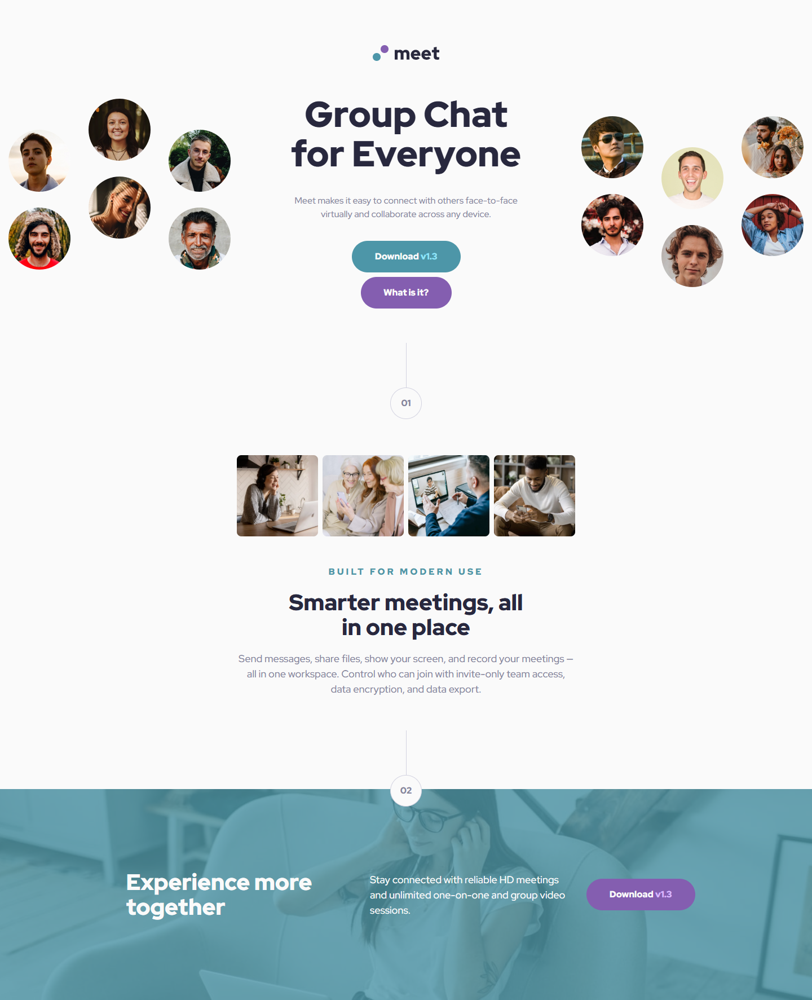

# Frontend Mentor - Meet landing page solution

This is a solution to the [Meet landing page challenge on Frontend Mentor](https://www.frontendmentor.io/challenges/meet-landing-page-rbTDS6OUR). Frontend Mentor challenges help you improve your coding skills by building realistic projects. 

## Table of contents

- [Frontend Mentor - Meet landing page solution](#frontend-mentor---meet-landing-page-solution)
  - [Table of contents](#table-of-contents)
  - [Overview](#overview)
    - [The challenge](#the-challenge)
    - [Screenshot](#screenshot)
    - [Links](#links)
  - [My process](#my-process)
    - [Built with](#built-with)
    - [What I learned](#what-i-learned)
      - [Issue 1: The hero image appears cropped on the sides, but the layout must not exceed the viewport or create a scrollbar.](#issue-1-the-hero-image-appears-cropped-on-the-sides-but-the-layout-must-not-exceed-the-viewport-or-create-a-scrollbar)
      - [Issue 2:  Title breaking on specific words](#issue-2--title-breaking-on-specific-words)
    - [Continued development](#continued-development)
    - [Useful resources](#useful-resources)
  - [Author](#author)
  - [Acknowledgments](#acknowledgments)


## Overview

### The challenge

Users should be able to:

- View the optimal layout depending on their device's screen size
- See hover states for interactive elements

### Screenshot

Desktop version:



Tablet version:


Mobile version:


### Links

- Solution URL: [Solution Repo](https://github.com/lia-oliveira/meet-landing-page)
- Live Site URL: [Solution Live](https://meet-landing-page-rosy.vercel.app/)

## My process

### Built with

- Semantic HTML5 markup
- CSS custom properties
- Flexbox
- Mobile-first workflow


### What I learned

This project was a bit more complex than the previous ones, and because of that, listing all the learning points would result in a very long list. So, below, I’ll focus only on the highlights.

#### Issue 1: The hero image appears cropped on the sides, but the layout must not exceed the viewport or create a scrollbar.

**Approach 1**:
1.1 Since the cropping occurred on the sides, I needed to stretch the image. However, this would cause the container to overflow. To prevent this, I set the hero container’s maximum width to 100% and applied overflow: hidden to hide any excess content and avoid creating a scrollbar.

1.2 For the image’s width, I used 100% + 50px, ensuring that the extra part of the image I didn’t want visible remained hidden.

1.3 Then, to center the image in the viewport, I applied a translate transformation with half the extra value added, sliding the image to the left and centering it perfectly.

```css
.hero {
    max-width: 100%;
    overflow: hidden;
}

.hero img {
    width: calc(100% + 3.125rem); /*50px*/
    translate: -25px;
    height: 169px;
}
```
At a 375px resolution, the placement matched the design perfectly. However, the image lacked elasticity, leading to significant distortion when the viewport size went beyond 400px or dropped below 375px.

**Aproach 2**:

```css
.hero {
    max-width: 100%;
}

.hero img {
    width: 100%;
    object-fit: cover;    
}
```
To achieve the cropped effect on the sides, I used a combination of translate on the image and overflow: hidden on the parent container.

In the end, I wasn’t satisfied with the effect and decided to remove it.

#### Issue 2:  Title breaking on specific words
In the hero title, the text always broke after the second word, regardless of the screen size.
1 - I established that the phrase Group Chat could not break into separate lines. To achieve this, I applied the break-line class.
2 - I ensured that the words for Everyone would stay together if a line break occurred by creating and applying the .no-break-line class.
```css

.break-line {
    word-wrap: break-word;
    display: inline-block; 
}

.no-break-line {
    white-space: nowrap;
    display: inline;
}
```

This approach worked well for screen sizes smaller than the total title length. However, when the viewport exceeded the title’s length, the text displayed in a single line. To address this issue, I set a maximum width of 17ch for the title container. The ch unit is based on the width of the “0” character in the chosen font, making it an effective measurement.

```css
.hero__content > h1 {
    max-width: 17ch;
}
```
Finally, I used a combination of max-width with the ch unit and media queries to ensure consistent behavior across screen sizes. I also removed the previously created classes that enforced or prevented line breaks.


I could also highlight other interesting aspects of this project, such as:
* The use of floating numbers, which added a dynamic visual effect.
* Increasing the number of columns in the desktop version of the hero section to improve content distribution and enhance the layout’s visual balance.
* Designing the background with the photo of the young woman, which required careful adjustments to ensure it remained visually appealing and responsive across different screen sizes.
  

### Continued development

I plan to do more research on background image positioning and intentional line breaks, as well as best practices for both topics.


### Useful resources

- SILVA, Julio César Brito da, ALBERTO, Matheus. A tag <picture>. Avaiable at: <[https://www.alura.com.br/artigos/srcset-trabalhando-imagens-responsivas?srsltid=AfmBOorzUeiIMpqnNL5QR6m_MwV8_4yoBZlTudaZSKcxzYqUt9S4-QDz](https://www.alura.com.br/artigos/srcset-trabalhando-imagens-responsivas?srsltid=AfmBOorzUeiIMpqnNL5QR6m_MwV8_4yoBZlTudaZSKcxzYqUt9S4-QDz)>. Acessed on: 09-12-2024.
- OLAWANLE, Joel. Estilo de Imagem CSS: aprimorando o apelo visual com estilo. Blog: Kinsta. Avaiable at: <[https://kinsta.com/pt/blog/estilo-de-imagem-css/](https://kinsta.com/pt/blog/estilo-de-imagem-css/)>. Acessed on: 11-12-2024.
- GUANABARA, Gustavo. Tamanho de fonte e suas medidas - @Curso em Vídeo HTML5 e CSS3. Avaiable at: <[https://www.youtube.com/watch?v=NGfPXJGiNH8](https://www.youtube.com/watch?v=NGfPXJGiNH8)>. Acessed on: 13-12-2024.
- MATIOLA, Willian. Botões em UI Design. Avaiable at: <[https://willianmatiola.medium.com/botoes-em-ui-design-e8e8a7473747](https://willianmatiola.medium.com/botoes-em-ui-design-e8e8a7473747)> .Acessed on: 13-12-2024.
- SNOW, Grace. Should I change the defaut HTML font-size to 62.5%?. Avaiable at: [https://fedmentor.dev/posts/rem-html-font-size-hack/](https://fedmentor.dev/posts/rem-html-font-size-hack/). Acessed on: 13-12-2024.

## Author

- Website - [Lia's Github](https://github.com/lia-oliveira)
- Frontend Mentor - [@liaoliveira](https://www.frontendmentor.io/profile/lia-oliveira)
- Twitter - [@byliaoliveira](https://x.com/byliaoliveira)


## Acknowledgments
I started using the [Pixel Perfect](https://chromewebstore.google.com/detail/perfectpixel-by-welldonec/dkaagdgjmgdmbnecmcefdhjekcoceebi) extension, recommended by [@benssssss](https://www.frontendmentor.io/profile/benssssss). I’m not fully used to it yet, but it has already helped me identify areas where I need to improve in observing the layout. I can confidently say that I now notice details I used to overlook. Thank you, [@benssssss](https://www.frontendmentor.io/profile/benssssss)!